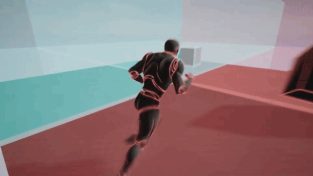

# ChanneldUE Plugin

## Features
- Increase the maximum capacity of a single UE dedicated server to 100-200 players without modifying the engine code ([Benchmark](benchmark.md)).
- Can combine multiple dedicated servers into one large world, supporting thousands of players online concurrently.
- Support a variety of application scenarios, including seamless large worlds, as well as traditional multi-room architecture and relay server architecture.
- Out-of-the-box synchronization solution that seamlessly integrates with the native UE's networking framework.
- Agile and extensible [client interest management](client-interest.md) mechanism.
- Support cross-server interaction (currently only support cross-server RPC and Rigid-body Physics; cross-server for AI, GAS or other systems require additional integration).
- [Dedicated server disaster recovery](disaster-recovery.md) without client disconnection/restart.
- Cloud-based dynamic load balancing can greatly save server costs (under development).
- Support [one-click cloud deployment](cloud-deployment-tool.md).

## Engine Versions Support Matrix
| Components | UE 4.27.2 | UE 5.2.1 | UE 5.3.2 |
| ------ | ------ | ------ |------ |
| Getting Started | :white_check_mark: | :white_check_mark: | :white_check_mark: |
| Demos Project | :white_check_mark: | :white_check_mark: | :white_check_mark: |
| Codegen Tool | :white_check_mark: | :white_check_mark: `*` | :white_check_mark: `*` |
| Cloud Deployment Tool | :white_check_mark: | :x: | :x:

`*` Need to turn off `Live Coding` in order to hot-reload the generated code.
