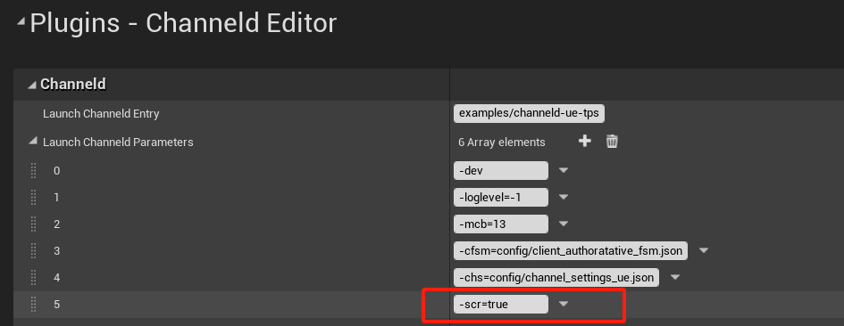

# Disaster Recovery
For games that need to operated after launch, server disaster recovery is something the developer should take seriously. This chapter introduces the support of ChanneldUE for disaster recovery.

## Dedicated Server
ChanneldUE supports dedicated servers to recover to the state before the crash point based on the subscriptions and data states stored in the channels. This way, the client does not need to reconnect or restart after the server recovers, ensuring the continuity of the player experience. At the same time, all replicated states will remain consistent before and after the crash, such as the position of players and world bosses. It should be noted that non-replicated states on the server will still be lost, such as the AI's movement target points. If these states also need to be restored after the crash, additional code is needed to achieve this.

> Currently, the restart after the crash needs to be done manually. In the future, there is a plan to update the cloud  deployment tools to achieve automatic restart.

### Enable Disaster Recovery
To enable the disaster recovery feature of the server, add `-scr=true` to the launch parameters of the channeld gateway service. The following figure shows how to set the global disaster recovery parameters in UE:



The following figure shows how to set the disaster recovery parameters for a level after setting up the [World Settings](world-settings.md):


### Add Client Pause Logic
After the server crashes, the channeld gateway service will discard all messages forwarded to the server. During this period, the client should also pause the game logic, stop sending any messages to the server (except for DisconnectMessage). The channeld gateway service will send the following messages to the client for handling the pause logic:

1. CHANNEL_OWNER_LOST: The owner of the channel is the handler of the messages sent by the client to the channel, generally the server connection. As introduced in [Basic Concepts](basic-concepts.md), a server connection can be the owner of multiple channels. When the server is abnormally disconnected, the channels it owns will broadcast the CHANNEL_OWNER_LOST message. When the client receives this message, it should first determine whether to pause the game according to the channel type. Generally, Global, Subworld, or Spatial channels need to pause the game; entity channels do not need to pause the game.

> Tip: channeld allows developers to configure which channel types will broadcast the CHANNEL_OWNER_LOST message after losing the owner. In the `channeld_settings_ue.json` file in the config folder under the channeld root directory, modify the `SendOwnerLostAndRecovered` property of each channel type.

2. CHANNEL_OWNER_RECOVERED: When the server recovers, the channels it owns will broadcast the CHANNEL_OWNER_RECOVERED message. When the client receives this message, it should resume the game.

The following blueprint demonstrates how to handle the channel owner lost and recovered events via `ChanneldGameInstanceSubsystem`:


This blueprint is located in the [ChanneldUE demo project](https://github.com/metaworking/channeld-ue-demos) at `Content/Blueprints/BP_RecoveryHandler`.

Placing this blueprint in the level can achieve the following effect:


### Custom Channel Recovery Logic
ChanneldUE has built-in recovery logic for Global, Subworld, Spatial, and Entity channel types. To extend the disaster recovery logic for other channel types, follow the steps below to add code.

If the channel's data recovery logic is simple and can be recovered based on the full channel data, you only need to add a view class in the UE project and override the `UChannelDataView::RecoverChannelData` function;

If the channel's data recovery logic is complex or requires additional data for recovery, you also need to add a channel data extension type in the channeld gateway service that implements the `channeld.ChannelDataExtension` interface. For example: a Private channel stores the player's inventory data, but the purchase time of the items in the inventory does not need to be replicated to the client, so it is not in the channel data. However, the server may rely on the purchase time to determine whether the item can be refunded. Therefore, in the server's purchase logic, the purchase time needs to be stored in the Private channel data extension:

```go
type PrivateChannelDataExtension struct {
	channeld.ChannelDataExtension

	itemPurchaseTime map[uint32]int64
}

func (ext *PrivateChannelDataExtension) Init(ch *channeld.Channel) {
	itemPurchaseTime := make(map[uint32]int64)
}

func (ext *PrivateChannelDataExtension) GetRecoveryDataMessage() common.Message {
	return &mygamepb.ChannelRecoveryData{
		ItemPurchaseTime: ext.spawnedObjs,
	}
}
```
    
Then, register the channel data extension type in `examples\channeld-ue-tps\main.go`:

```go
    channeld.SetChannelDataExtension[PrivateChannelDataExtension](channeldpb.ChannelType_PRIVATE)
```

Finally, read the `ChannelRecoveryData` message in the `UChannelDataView::RecoverChannelData` override function to restore the server state.