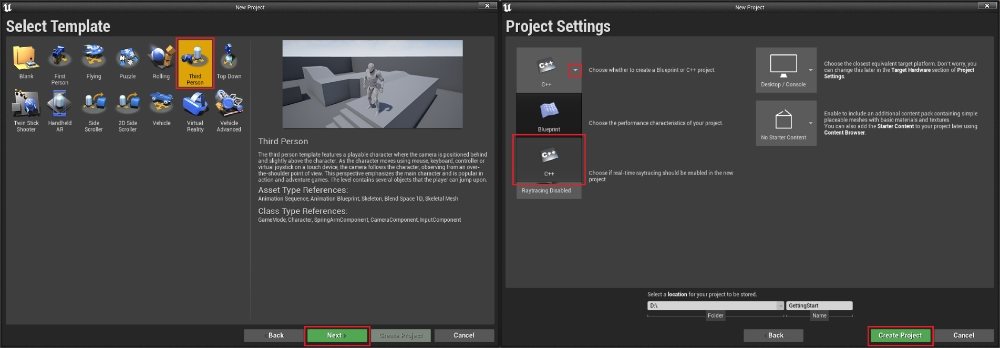

# Prerequisites
ChanneldUE plugin has been tested on Windows 10/11 with UE 4.27/5.1/5.2/5.3. It may not work on other platforms or engine versions.

# 1.Install ChanneldUE plugin
## 1.1.Clone the repository
Clone the repository to your local machine using git:
```bash
git clone https://github.com/metaworking/channeld-ue-plugin.git
```

## 1.2.Initialize the plugin
Run the `Setup.bat` script in the plugin root directory. This script will download and install the dependencies of the plugin, including:
```
golang - Used to run channeld
channeld - The gateway service
protoc-gen-go - Protobuf code generator for golang
```

# 2.Create a Third Person Template project
## 2.1.Create a project
#### 2.1.1.Create a new UE project based on the Third Person Template
Create a new UE project based on the Third Person Template. Choose the project type as `C++`:


>Note: ChanneldUE plugin only supports C++ projects. If you are using a Blueprint-only project, you need to convert it to a C++ project first.

##### 2.1.2.Copy the plugin
Copy the cloned plugin code repository directory from step 1.1. to the `Plugins` directory of the project.

##### 2.1.3.Modify the project's Build.cs file
Add the plugin modules `ChanneldUE` and `ProtobufUE` to the project:
```csharp
PublicDependencyModuleNames.AddRange(new string[] { "Core", "CoreUObject", "Engine", "InputCore", "ChanneldUE", "ProtobufUE" });
```

##### 2.1.4.Modify the project's configuration file
Open `Config/DefaultEngine.ini` in the project and add the plugin-related log output levels:
```ini
[Core.log]
LogChanneld=Verbose
LogChanneldGen=Verbose
LogChanneldEditor=Verbose
LogChanneldRepGenerator=Verbose
```

>Note: This configuration uses a lower log output level. It is recommended to enable Verbose logs during development to for better troubleshooting and issue reporting. For publish, it is recommended to change the log level to Log or Warn to reduce performance and file storage overhead.

## 2.2.Recompile and run the project and enable the plugin
Right-click on the `*.uproject` file of the project in the file browser, select "Generate Visual Studio project files" to regenerate the project's solution file.
Reload the solution in Visual Studio and recompile and run the project. When the UE editor opens again, the plugin icon should appear in the toolbar:


If the plugin icon doesn't show up, select `Edit -> Plugins -> Other -> ChanneldUE -> Enabled` in the top menu bar of the editor to enable the plugin.

## Next Step
In the following chapter, we will show you how to run the Third Person Template project based on the ChanneldUE's network framework. [Click here](third-person-template.md) to continue.

[Back to the main page](README.md)
