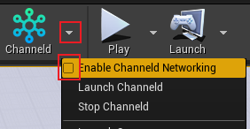
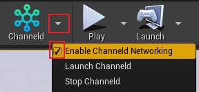
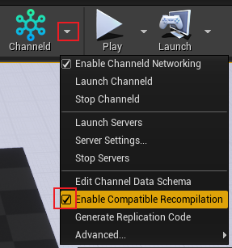
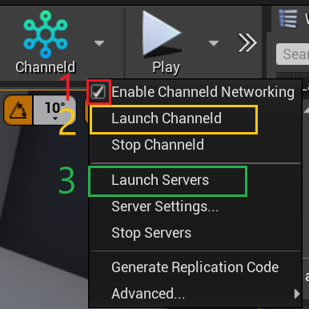

# Recommended Workflow
## Local Development Iteration
### Use native UE for development iteration
In daily development, it is recommended to use [native UE networking](https://docs.unrealengine.com/4.27/en-US/InteractiveExperiences/Networking/Actors/) for GamePlay development and debugging. After implementing the Gameplay function, use ChanneldUE for testing and debugging. This can avoid frequent code generation, and servers/ gateway service start and stop.

>To use the native UE networking, please make sure that ChanneldUE's networking is disabled:
>
>

### Use ChanneldUE for testing
Enable ChanneldUE networking to switch the native UE networking to ChanneldUE networking:



#### Enable ChanneldUE replication for an Actor
An Actor that uses networking or RPC needs to add a replication component. The specific steps are as follows:
* Add a replication component to a C++ Actor
    1. Declare the `ChanneldReplicationComponent` component in the Actor class:
    ```cpp
    #include "Replication/ChanneldReplicationComponent.h"
    ...
    class XXX_API ACppActor : public AActor
    {
        GENERATED_BODY()
    protected:
        UPROPERTY()
        UChanneldReplicationComponent* ChanneldReplicationComponent;
        ...
    };
    ```

    2. Instantiate the `ChanneldReplicationComponent` component in the Actor's constructor:
    ```cpp
    ACppActor::ACppActor()
    {
        ChanneldReplicationComponent = CreateDefaultSubobject<UChanneldReplicationComponent>(TEXT("ChanneldReplication"));
    }
    ```
* Add a replication component to a Blueprint Actor
  
  

#### Add replication components to Actors in batches
In addition to manually adding replication components to Actors, ChanneldUE provides a tool to add replication components to existing Actors in batches:


> Note: This tool will load all Actors in the project. If there are a large number of Actors in the project, it may cause a long loading time.

#### Configure the Channel Data Schema
After adding a replication component to the Actor, you also need to configure the Channel Data Schema to map the Actor to the channel data.
> For more information about the Channel Data Schema, please refer to [Channel Data Schema](./channel-data-schema.md)

Click the `Editor Channel Data Schema` button of the ChannelUE plugin:


The following editor window will be opened:


##### Add Actor state to the Channel Data Schema
First, if the replication cache is expired (yellow exclamation mark), you need to update it. Click the `Cook...` button above the channel data editor:


After the replication cache is updated, add the newly added replicated Actor to a channel: (The following figure shows that `BP_TestRep` is mapped to the Global channel. Because `BP_TestRep` depends on the `StaticMeshComponent` component, this component is also added to the Global channel at the same time.)

##### GameState
Usually, there is only one instance of GameState on the server, so you can set the state of GameState to singleton:


> In the case of multiple servers, it is recommended to put the state of GameState in the Global channel and set it to singleton to ensure that the state of GameState is consistent across all servers.
> In addition to GameState, WorldSettings class also has only one instance in a game world, so it is also recommended to set its state to singleton.

#### Generate replication code
After configuring the Channel Data Schema, you need to generate the replication code. The replication code is mainly used to implement the state replication in the Channel Data Schema.


##### Hot-reload compatible mode
ChanneldUE provides a hot-reload compatible mode. In this mode, the project source code is automatically hot-reloaded after the replication code is generated. If the hot-reload compatible mode is turned off, you need to close the UE editor and recompile the project code before running the game again.



> In the hot-reload compatible mode, the generated replication code will be different each time, so it is recommended to turn off the hot-reload compatible mode and generate the replication code again before the release packaging.

### Local testing
Since ChanneldUE uses a distributed dedicated server architecture, you need to start the channeld gateway service and multiple dedicated servers for local testing. ChanneldUE provides related startup tools.

Open the gateway service and dedicated server through the dropdown menu of the plugin, the steps are as follows:


1. Make sure that the ChanneldUE networking is enabled
2. Click `Launch Channeld` to start the channel gateway service

    The following output will be displayed when the channeld gateway service is started successfully:
    

3. Click `Launch Servers` to start the dedicated server
    
#### Test multiple clients
If you want to start multiple clients at the same time, you need to make some modifications to the default editor settings. Open the `Editor Preferences -> Level Editor -> Play`, in `Multiplayer options`, **uncheck** `Run Under One Process`:


#### Stop the dedicated server or gateway service
If you need to modify assets such as Blueprints or levels during the test, please remember to close the dedicated server before saving the changes, otherwise the UE editor will prompt that the changes cannot be saved.

After the test is completed, you can stop the dedicated server and gateway service through the dropdown menu of the plugin. Click `Stop Servers` and `Stop Channeld` in turn to stop the dedicated server and gateway service.


## Collaboration and Version Control
### Channel Data Schema
#### Channel Data Schema Definition File
It is recommended to version control the Channel Data Schema definition file to ensure that the generated replication code is consistent between the collaborators. The Channel Data Schema definition file is located at `Config/ChanneldChannelDataSchema.json`.

#### Synchronize the Channel Data Schema
If you have updated the project code through version control before configuring the Channel Data Schema, please [update the replication cache](#add-actor-state-to-the-channel-data-schema) first to ensure that the channel data state can be displayed correctly in the channel data editor.

### Replication Code
#### Regenerate the replication code
When the UE editor is **not running**, if you have updated the project code through version control, it is recommended to perform the following operations:
1. Manually delete the files under the `Source/<Game Module>/ChanneldGenerated` directory
2. Compile and run the project
3. [Generate the replication code](#generate-replication-code)
> If you are using git as the version control tool, you can add the logic of deleting the `Source/<Game Module>/ChanneldGenerated` directory in the `.git/hooks/post-merge` script under the project root directory.

When the UE editor is **running**, if you have updated the project code through version control, you need to [generate the replication code](#generate-replication-code) again.

#### Files to ignore
It is recommended to ignore the replication code to the ignore list of the version control tool.
If you are using git as the version control tool, you can add the following content to the `.gitignore` file under the project root directory:
> ```
> # ChanneldUE generated replication code
> /Source/**/ChanneldGenerated
> ```

Usually, the channeld gateway service will not be version controlled. But when the developer needs to modify the channeld gateway service source code and version control it, it is recommended to ignore the replication code generated by ChanneldUE:

> If you are using git as the version control tool, you can add the following content to the `.gitignore` file under the channeld gateway service root directory:
> ```
> # ChanneldUE generated replication code
> channeldue.gen.go
> *.gen.go
> ```

## Plugin Upgrade
The workflow of upgrading the ChanneldUE plugin is as follows:
1. Make sure that the UE editor is closed
2. Pull the latest code and switch the branch to the new version tag, such as: `git checkout v0.6.0`. If you are already on the `release` branch, you don't need to switch branches.
3. If you have ever run the `Setup.bat` of the plugin, the channeld code repository will automatically switch to the branch that matches the tag; otherwise, you need to manually pull the latest code in the local channeld code repository and switch to the branch that matches the tag
4. Delete the `ChanneldGenerated` folder in the project Source directory
5. Regenerate the project solution file
6. Recompile the project and run it
7. Open the Channel Data Schema editor (toolbar ChanneldUE plugin dropdown menu -> `Edit Channel Data Schema...`)
8. Click the `Cook...` button to refresh the replication cache and the static GUID registry
9. There was a major upgrade in v0.6 regarding the spatial channel. If you haven't done it yet, please re-add the states that were in the `Spatial` channel to the `Entity` channel
10. Click the `Generate...` button to generate the replication code

Now, the project should be able to run under the new version of the ChanneldUE plugin.
